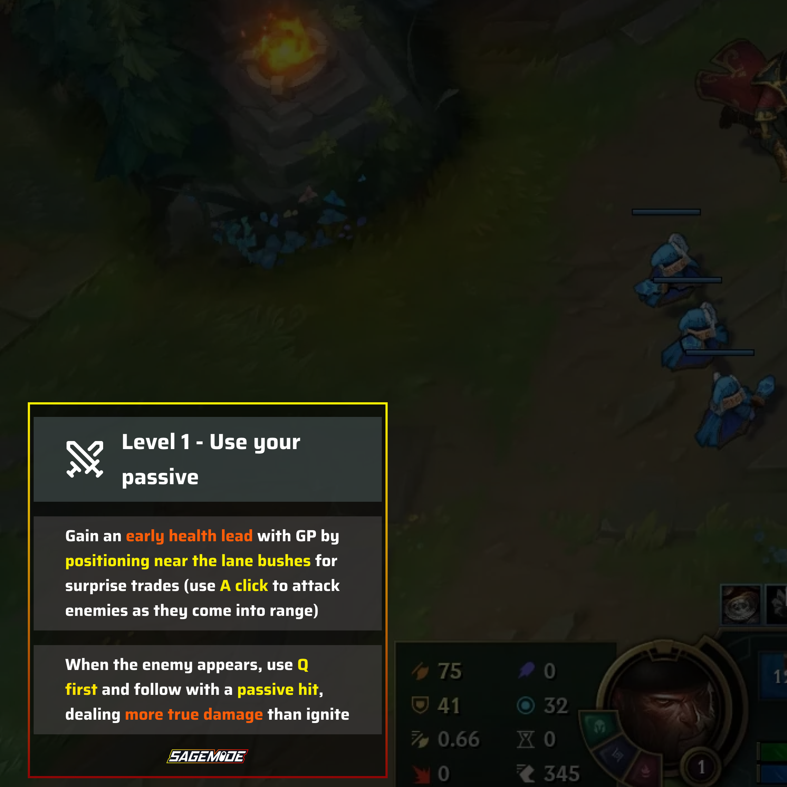
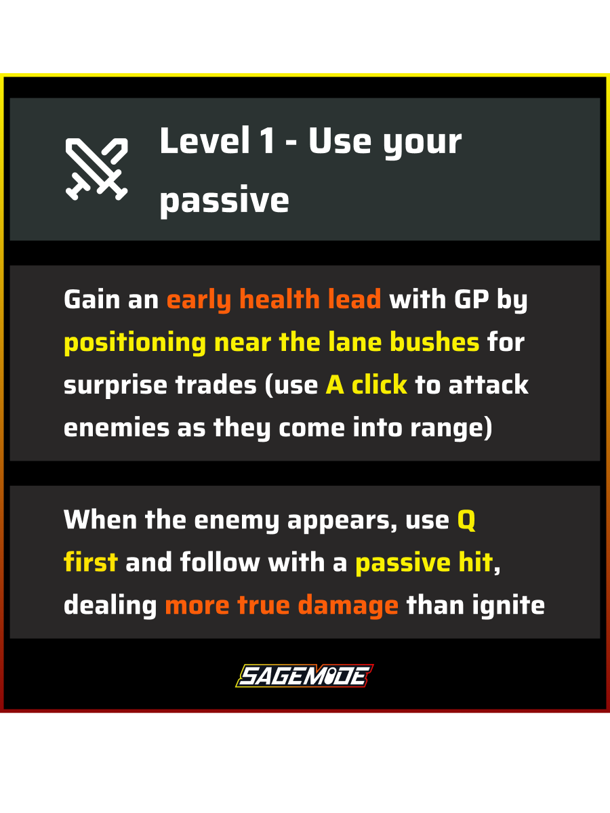
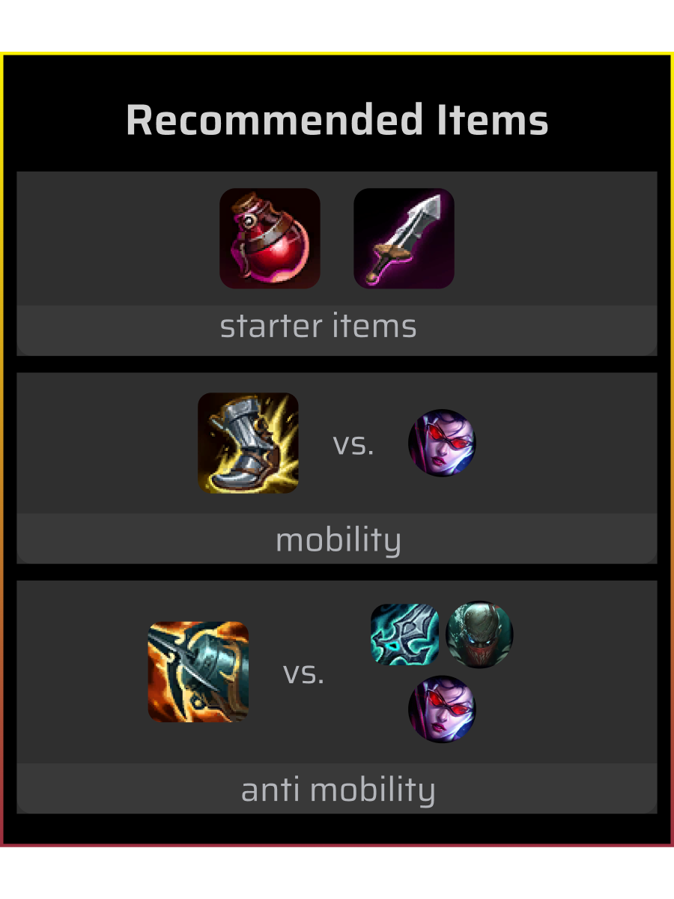
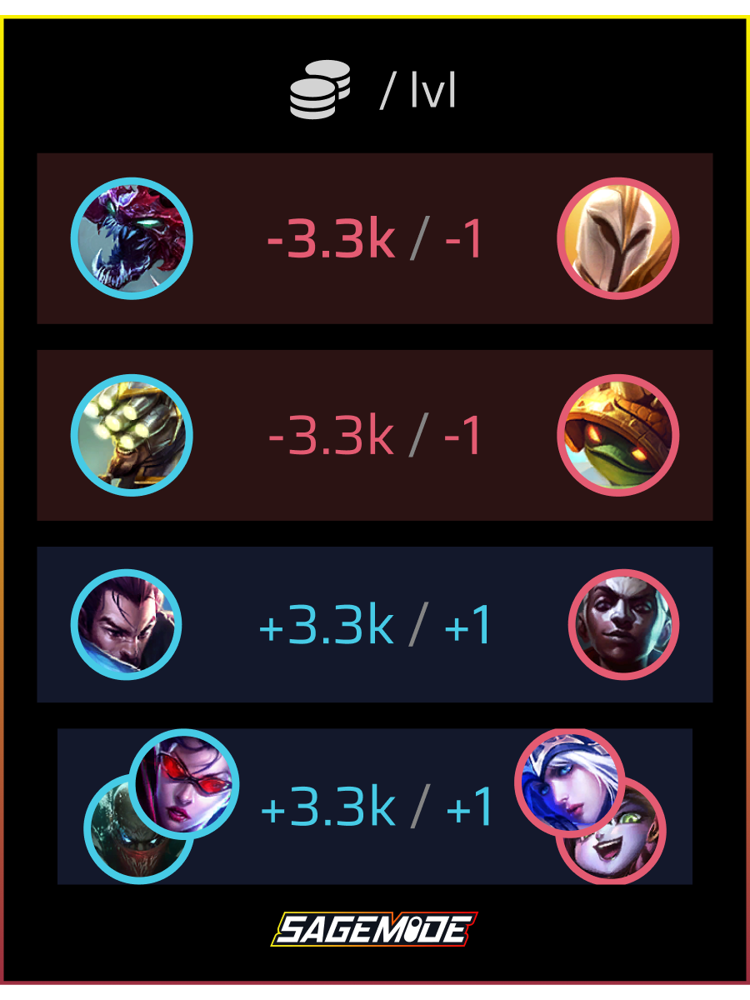

# Sagemode - Your League of Legends Companion

Sagemode is an AI-powered companion for League of Legends that provides real-time guidance, recommendations, and insights to help improve your gameplay.

## Features

### Real-time In-game Assistance
Get contextual advice during your matches to make better decisions and improve your performance.

### Recommended Items
Receive personalized item recommendations based on your champion, role, and the current match situation.

### Level and Power Comparison
See how you compare against your lane opponent and track your advantages or disadvantages.

## Installation

### Windows
1. Download the latest installer from [our website](https://www.sagemode.gg)
2. Run the installer file (Sagemode-Setup-x.x.x.exe)
3. Follow the on-screen instructions to complete installation
4. Launch Sagemode from your desktop or start menu
5. Log in with your account or create a new one

### macOS
1. Download the latest macOS app from [our website](https://www.sagemode.gg)
2. Open the downloaded .dmg file
3. Drag the Sagemode icon to your Applications folder
4. Launch Sagemode from your Applications folder
5. If prompted about security settings, go to System Preferences > Security & Privacy and allow Sagemode to run
6. Log in with your account or create a new one

## Getting Help

If you encounter any issues or have questions:

- Email us at [hello@sagemode.gg](mailto:hello@sagemode.gg)
- Join our [Discord community](https://discord.gg/EVJhNnAqBJ)

## Stay Connected

Visit [sagemode.gg](https://www.sagemode.gg) for the latest updates and news.
